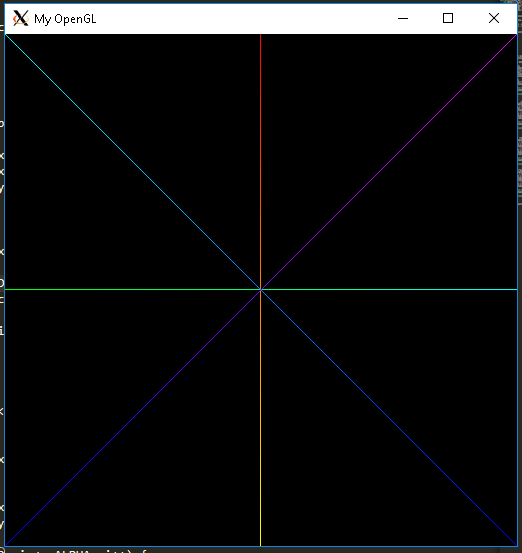
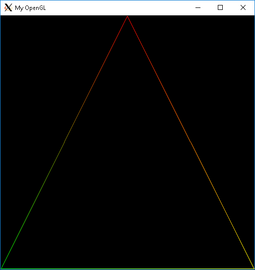

# Raterizção de Pontos e Linhas
	O trabalho consiste em implementar algoritmos de rasterização para pontos e linhas. Triângulos deverão ser desenhados através da rasterização das linhas que compõem suas arestas.
  
## O que é Rasterização?
	O processo de converter uma imagem vetorial em uma imagem raster (pontos ou píxel) para a saída em vídeo ou em impressora.
    
## Criação de um pixel
	Um pixel é nada menos que uma coordenada vetorial (x,y), contendo também informações das cores, o RGBA. Então geramos um *struct* denominda Pixel, com as seguintes informações:
 
 ```
  struct Pixel{

	 int x;
	 int y;
	unsigned char color[4];
};
  ```
	O unsigned char foi usado por nós devido a representação das cores estarem dentro de um universo finito, entre os valores de 0 a 255.
  
	Já o enum foi criado para referenciar de maneira mais fácil qual o elemento do array corresponde a qual elemento do RGBA:
	
  ```
  enum colors
{
	RED   = 0,
    GREEN = 1,
    BLUE  = 2,
    ALPHA = 3
};
  ```
  
	Com isso, temos toda a estrutura para gerarmos um pixel. Sendo inicializado pela seguinte maneira:
	
  ```
  Pixel criaPixel(int x, int y, unsigned char red, unsigned char green, unsigned char blue, unsigned char alpha, Pixel pixel){

	pixel.x = x;
	pixel.y = y;

	pixel.color[RED] = red;
	pixel.color[GREEN] = green;
	pixel.color[BLUE] = blue;
	pixel.color[ALPHA] = alpha;

	return pixel;
}
  ```
  
	Com o pixel gerado, podemos finalmente representá-lo na tela com o seguinte código:
  ```
  void putPixel(Pixel p){
	int offset = 4*p.x+4*p.y*IMAGE_WIDTH;  
	FBptr[offset+RED] = p.color[RED];
	FBptr[offset+GREEN] = p.color[GREEN];
	FBptr[offset+BLUE]  = p.color[BLUE];
	FBptr[offset+ALPHA] = p.color[ALPHA];	
}
  ```
  
	Como resultado temos:
  
  
  
## Criando Linhas
	Com o pixel feito, agora podemos representar uma reta, que é o conjunto de vários pixels em série. Para isso usaremos a função *drawLine* e o algoritmo de Bresenham.
	O algoritmo se baseia no critério do ponto. Onde para cada coluna de pixels, existem 2 pixels que se encontram mais próximo de uma reta um acima e outro abaixo desta. A escolha do pixel a ser ativado, é feita através da distância da interseção da reta com a coluna de píxeis a cada um dos dois píxeis, escolhendo-se então o pixel mais próximo da interseção. Os pixels que compõem um segmento de reta devem ser vizinhos, o que permite visualizar quais pontos numa matriz de base quadriculada que deve ser destacados para atender o grau de inclinação da reta dy/dx.
	Com isso temos nosso seguinte *drawLine*:
	
	```
	void drawLine(Pixel pixelInicial, Pixel pixelFinal){

		int d, dx, dy, incE, incNE, x, y, declive;

		dx = pixelFinal.x - pixelInicial.x;
		dy = pixelFinal.y - pixelInicial.y;

		if(dx<0){
			std::swap(pixelInicial, pixelFinal);
			dx = -dx;
			dy = -dy;
		}

		if(dy<0){
			declive=-1;
		}
		else{
			declive=1;
		}

		Pixel tempPixel = pixelInicial;
		putPixel(pixelInicial);
	```
	
	Para o coeficiente angular menor ou igual a 1
	```
		if(declive*dy <= dx){
		if(dy<0){
			d=2*dy+dx;
			while(tempPixel.x<pixelFinal.x){
				if(d<0){
					d+=2*(dy+dx);
					tempPixel.x++;
					tempPixel.y--;
				}
				else{
					d+=2*dy;
					tempPixel.x;
				}
				for(int i = RED; i<=ALPHA; i++){
					tempPixel.color[i] = (unsigned char)(pixelInicial.color[i] + (tempPixel.x - pixelInicial.x)*(pixelFinal.color[i] - pixelInicial.color[i])/dx);
				}
				putPixel(tempPixel);
			}
		
		} else {
            d = 2*dy - dx;            
            while(tempPixel.x < pixelFinal.x) { 
                if(d < 0) {                 
                    d+= 2*dy;
                    tempPixel.x++;
                } else {                    
                    d += 2*(dy - dx);
                    tempPixel.x++;
                    tempPixel.y++;;
                }
                for(int i = RED; i <= ALPHA; i++) {
                    tempPixel.color[i] = (unsigned char)(pixelInicial.color[i] + (tempPixel.x - pixelInicial.x)*(pixelFinal.color[i] - pixelInicial.color[i])/dx);
                }
                putPixel(tempPixel);
            }
        }
	```
	
	Para o coeficiente angular maior que 1
	```
		}else{
        if(dy < 0) {
            d = dy + 2*dx;
            while( tempPixel.y > pixelFinal.y ) {     
                if(d < 0) {                
                    d += 2*dx;
                    tempPixel.y--;
                } else {
                    d += 2*(dy + dx);
                    tempPixel.x++;
                    tempPixel.y--;
                }
                for(int i = RED; i <= ALPHA; i++) {   
                    tempPixel.color[i] = (unsigned char)(pixelInicial.color[i] + (tempPixel.y - pixelInicial.y)*(pixelFinal.color[i] - pixelInicial.color[i])/dy);
                }
                putPixel(tempPixel);
            }
        } else {
            d = dy -2*dx;
            while( tempPixel.y < pixelFinal.y ) {
                if(d < 0) { 
                    d += 2*(dy - dx);
                    tempPixel.x++;
                    tempPixel.y++;
                } else {
                    d += -2*dx;
                    tempPixel.y++;
                }
                for(int i = RED; i <= ALPHA; i++) {    // for each component, interpolate
                    tempPixel.color[i] = (unsigned char)(pixelInicial.color[i] + (tempPixel.y - pixelInicial.y)*(pixelFinal.color[i] - pixelInicial.color[i])/dy);
                }
                putPixel(tempPixel);
            }
        }
    }
	```
	
	Por fim, a impressão final:
		```
		putPixel(pixelFinal);
		```
		
	
	
## Criando Triângulos
		Triângulo nada mais é que 3 vértices ligadas, então, apenas devemos ter 3 pixels e liga-los usando o drawLine:
		
		```
		void drawTriangle(Pixel p1, Pixel p2, Pixel p3){
			drawLine(p1,p2);
			drawLine(p2,p3);
			drawLine(p3,p1);
		}
		```
		
		


## Dificuldades
	Utilizar as bibliotecas do OpenGL no Windows foi bem problemático. Enfrentei vários problemas com todas as IDEs que tentei utilizar. Não desisti e encontrei uma solução para o problema! Adicionando o bash do Ubuntu ao Windows juntamente com o Xming para visualização da janela gerada pelo OpenGL, você consegue sem problema algum trabalhar como se estivesse no Ubuntu.

		
## Referências
	1 - https://jansebp.wordpress.com/2012/12/16/icg-t1-rasterizacao/

	2 - https://en.wikipedia.org/wiki/Bresenham%27s_line_algorithm

	3 - http://fleigfleig.blogspot.com/2016/

	4 - http://www.univasf.edu.br/~jorge.cavalcanti/comput_graf04_prim_graficas2.pdf