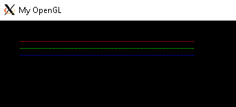

# Raterizção de Pontos e Linhas
  O trabalho consiste em implementar algoritmos de rasterização para pontos e linhas. Triângulos deverão ser desenhados através da rasterização das linhas que compõem suas arestas.
  
## O que é Rasterização?
  O processo de converter uma imagem vetorial em uma imagem raster (pontos ou píxel) para a saída em vídeo ou em impressora.
    
## Criação de um pixel
  Um pixel é nada menos que uma coordenada vetorial (x,y), contendo também informações das cores, o RGBA. Então geramos um *struct* denominda Pixel, com as seguintes informações:
  ```
  struct Pixel{

	 int x;
	 int y;
	unsigned char color[4];
};
  ```
  O unsigned char foi usado por nós devido a representação das cores estarem dentro de um universo finito, entre os valores de 0 a 255.
  
  Já o enum foi criado para referenciar de maneira mais fácil qual o elemento do array corresponde a qual elemento do RGBA:
  ```
  enum colors
{
	RED   = 0,
    GREEN = 1,
    BLUE  = 2,
    ALPHA = 3
};
  ```
  
  Com isso, temos toda a estrutura para gerarmos um pixel. Sendo inicializado pela seguinte maneira:
  ```
  Pixel criaPixel(int x, int y, unsigned char red, unsigned char green, unsigned char blue, unsigned char alpha, Pixel pixel){

	pixel.x = x;
	pixel.y = y;

	pixel.color[RED] = red;
	pixel.color[GREEN] = green;
	pixel.color[BLUE] = blue;
	pixel.color[ALPHA] = alpha;

	return pixel;
}
  ```
  
  Com o pixel gerado, podemos finalmente representá-lo na tela com o seguinte código:
  ```
  void putPixel(Pixel p){
	int offset = 4*p.x+4*p.y*IMAGE_WIDTH;  
	FBptr[offset+RED] = p.color[RED];
	FBptr[offset+GREEN] = p.color[GREEN];
	FBptr[offset+BLUE]  = p.color[BLUE];
	FBptr[offset+ALPHA] = p.color[ALPHA];	
}
  ```
  
  Como resultado temos:
  