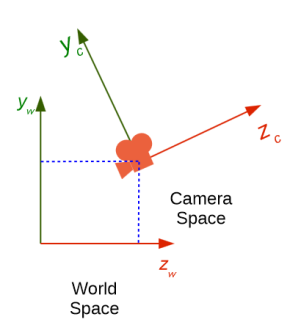
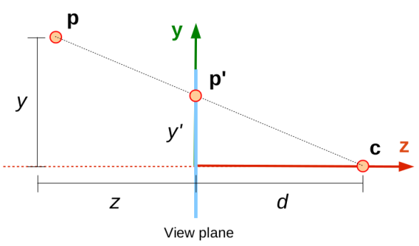

#Trabalho II - Implementação do Pipeline gráfico

## Obejtivo

O trabalho consiste em implementar todas as etapas do pipeline gráfico aplicando todas as transformações do pipeline gráfico em um objeto tridimensional. Saíndo do espaço do objeto até o espaço de tela. Tudo isso fazendo uso das bibliotecas GLUT e OpenGL.

## Pipeline Gráfico

O Pipeline Gráfico é do o conjunto etapas necessárias envolvendo transformações matemáticas para criar a representação de um objeto 3D representado como 2D na tela. Abaixo, segue uma imagem do algoritmo do pipeline gráfico.

### Pipeline Gráfico
<p align="center">
	<br>
	
	<h5 align="center">Figura 1 - Representação do Pipeline Gráfico</h5>
	<br>
</p>


### Espaço do Objeto -> Espaço do Universo

É o espaço onde cada objeto é criado e modelado a partir de suas primitivas geométricas e que possui seu próprio sistema de coordenadas. 

Quando um objeto é criado, este, está situado na origem de seu espaço, e que nem sempre condiz com a origem do Espaço do Universo, como mostra a figura 2. Para trazer o objeto para o Espaço do Universo é preciso realizar uma série de transformações geométricas.

<p align="center">
	<br>
	
	<h5 align="center">Figura 2 - Representação do Objeto no Espaço do Objeto e no Espaço do Universo</h5>
	<br>
</p>

Para realizar a transformação é necessário realiar a multiplicação dos vértices do objeto pela matriz de modelagem. Esta matriz de modelagem(Matriz Model) pode ser composta rotação, translação, escala e cisalhamento. E caso nenhuma transformação seja necessária, é feita a multiplicação pela matriz identidade. Segue abaixo o código referente as transformações citadas.

#### Matriz de Rotação
```C++

ADICIONAR O MÉTODO DA MATRIZ DE ROTAÇÃO

```

#### Matriz de TRANSLAÇÂO
```C++

ADICIONAR O MÉTODO DA MATRIZ DE TRANSLAÇÃO

```

#### Matriz de ESCALA
```C++

ADICIONAR O MÉTODO DA MATRIZ DE ESCALA

```

#### Matriz de CISALHAMENTO(Shear)
```C++

ADICIONAR O MÉTODO DA MATRIZ DE CISALHAMENTO

```

Para realização de mais de uma transformação, basta realizar o produto das matrizes de transformações. Seguindo sempre de invertar a ordem das operações em relação as transformações desejadas para que o produto resulte no objetivo esperado.


### Espaço do Universo -> Espaço da Câmera

Em seguida devemos sair do Espaço do Universo para o Espaço da Câmera, que será a forma de como o nosso objeto será visto pela câmera. Sendo necessário assim definir a posição da câmera, a orientação(para onde está olhando) e qual lado é o de cima, para que tenhamos controle total da orientação da câmera. O resultado destra transformação é a Matriz View que é composta por uma translação e uma rotação.

Segue abaixo a imagem que ilustra a situação descrita.

<p align="center">
	<br>
	
	<h5 align="center">Figura 3 - Representação Espaço do Universo vs Espaço da Cãmera</h5>
	<br>
</p>

### Matriz View

```C++

ADICIONAR O MÉTODO DA MATRIZ VIEW

```


### Espaço da Câmera -> Espaço de Recorte/Projetivo

Nesta estapa é feita a transformação para sair do Espaço da Câmera para o Espaço de Recorte, gerando uma nova matriz, a Matriz de Projeção(Matrix Projection). Essa matriz, contém as características de distorção de perspectiva, fazendo com que objetos mais próximos da câmera fiquem maiores e os que estão mais distantes se apresentem em tamanho menor.

A figura 4 ilustra o que ocorre nessa transformação. O "c" é a posição da câmera, "d" é definido como a distância focal da câmera, p um ponto no espaço da câmera e p' sua projeção. 


<p align="center">
	<br>
	
	<h5 align="center">Figura 4 - Projeção de Perspectiva</h5>
	<br>
</p>

### Matriz de Projeção

```C++

ADICIONAR O MÉTODO DA MATRIZ Projection
```

### Espaço de Recorte -> Espaço Canônico

Esta estapa é responsável por eliminar os vértices que não estão na visão da câmera do pipeline gráfico. Para realizar esta função primeiro precisamos primeiro transformar as coordenadas Euclidianas em coordenadas homogêneas.

As coordenadas homogêneas são uma forma de representar coordenadas de N-dimensões com números N+1.
O sistema de coordenadas Euclidianas representam espaços 2D e 3D de forma "ótima" e isso, de certa forma, gera um problema quando se trata de projeção de perspectiva. Um exemplo disso são retas paralelas indo ao infinito, sua representação de perspectiva no espaço deveria ilustrar as retas se encontrando mas isso não ocorre com coordenadas euclidianas, para isso fazemos uso de coordenadas homogêneas. 

Para realizar o processo de homogeneização adicionamos uma variável, w, no sistema de coordenadas, saindo de um sistema (x,y,z) para (x,y,z,w). Onde X, Y e Z são expressados de forma homogênea como: 

- X = x/w
- Y = y/w
- Z = z/w

Para realizar o processo de homogeinização dividimos as coordenadas dos vértice(pontos) provindos do espaço de recorte pela sua coordenada homogenea(w).

### Matriz View

```C++

ADICIONAR O MÉTODO DA MATRIZ VIEW
```

### Espaço Canônico -> Espaço de Tela

Saindo do espaço canônico e indo paara o Espaço de Tela, os vértices serão mapeados para o espaço de tela fazendo uso de outra transformação, chamada de Matriz Viewport.
Para isso precisamos realizar transformações de escalas e translações, uma vez que o sistema de coordenadas da tela começam pelo canto superior esquerdo e crescem no sentido para baixo e direita.

### Matriz ViewPort

```C++

Adicionar O MÉTODO DA MATRIZ ViewPort
```

### Rasteirização

Para finalizar o pipeline temos a rasteirização. Para realizar a rasteirização basta chamar as funções criadas no trabalho anterior.

### Rasteirizando

```C++

Adicionar O MÉTODO DE RASTEIRIZAÇÃO
```